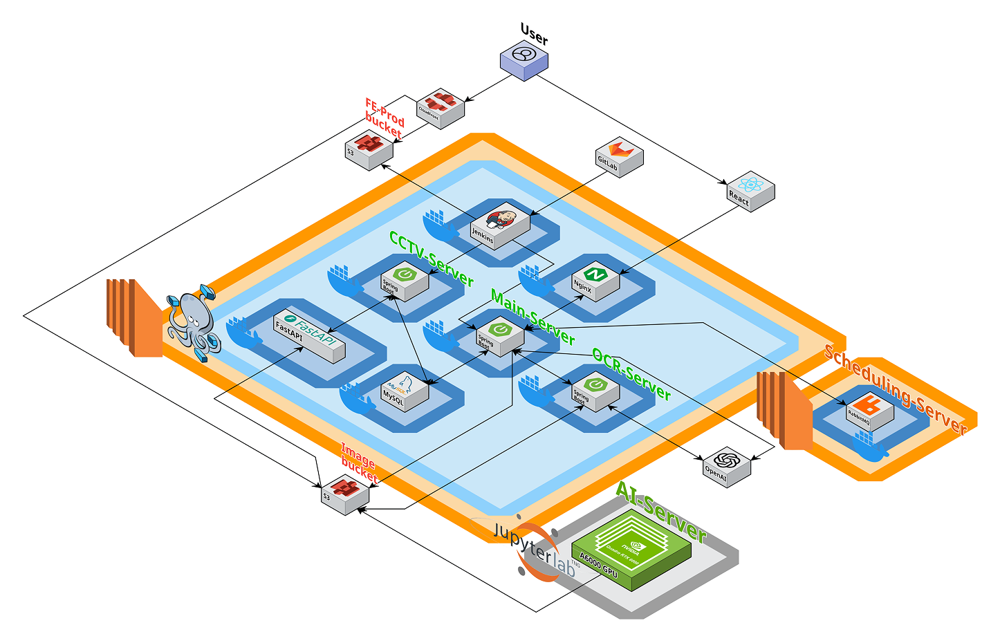

<div align="center">

# 🏠 품으로

### 실종자 발생 시 시민들이 적극적으로 대응할 수 있도록 돕는<br/>실시간 실종자 정보 통합 플랫폼

[](https://back2poom.site)

</div>

---

## 📑 목차

- [기획 배경](#-기획-배경)
- [주요 기능](#-주요-기능)
- [기술 특이점](#-기술-특이점)
- [기술 스택](#-기술-스택)
- [시스템 아키텍처](#-시스템-아키텍처)

---

## 💡 기획 배경

<div align="center">

[](https://www.youtube.com/watch?v=swav_WcNcA8)

**🎬 영상을 클릭하면 프로젝트 소개 영상을 시청하실 수 있습니다**

</div>

<br/>

> **2024년 실종신고 49,624건**

실종신고 건수 중 상당수가 **아동·장애인·치매 환자 등 취약계층**이며, 특히 장기 실종으로 이어질 경우 가족이 감당해야 할 심리적·경제적 부담이 매우 큽니다.

### 🚨 현재 실종경보시스템의 한계
실종경보문자는 2021년부터 취약계층의 조기 발견을 위해 운영되고 있지만,

- **나열식 텍스트** 중심의 정보 제공
- **저화질 이미지**로 인한 식별 어려움
- **위치 정보의 불명확한 전달**
- **직관적이지 않은 정보 구조**

**품으로**는 이러한 문제점을 AI와 지도 기술로 해결하여, 실종자의 조기 발견 확률을 높이고자 합니다.

---

## 🎯 주요 기능

**품으로**는 지도와 Diffusion 기반 AI 기술로 기존 실종경보시스템의 정보 전달 한계를 보완하며, 간편 제보 기능으로 제보자의 부담을 감소시키고, CCTV 영상에서 실종자를 실시간으로 탐지하는 파이프라인을 구현합니다.

### 1️⃣ 실종자 정보 제공
- **실종 위치 지도 시각화** 및 이동반경 예측
- 실시간 실종자 현황 대시보드

### 2️⃣ AI 기반 이미지 고도화
- **저화질 이미지 복원** (Super-Resolution)
- AI 기반 실종자 몽타주 생성

### 3️⃣ 간편 제보 기능
- **간편 문자 신고** 지원
- 신속한 제보 처리 시스템

### 4️⃣ 경찰청 관제 시스템
- **CCTV 기반 실시간 실종자 탐지**
- AI 기반 자동 매칭 알림

---

## 🔬 기술 특이점

**품으로**는 실종자 몽타주 생성 기술 및 실시간 CCTV 탐지 모델을 구현하여, 저해상도 이미지를 Super-Resolution으로 선명하게 재구성하고, MMDiT 모델로 실종자에 대한 텍스트와 이미지 정보를 결합해 인상착의를 예측 및 생성합니다. 코사인 유사도 기반 임베딩 매칭으로 CCTV에서 실종자를 추적할 수 있습니다.

### 🎯 핵심 기술

#### 1. 이미지 업스케일링
```
Diffusion 모델 기반 저화질 이미지 복원
→ 실종자 사진의 선명도를 높여 식별률 향상
```

#### 2. MMDiT 경량화
```
LoRA 파인튜닝 기법을 통한 실종자 몽타주 생성 특화
→ 텍스트 설명과 이미지를 결합한 정확한 몽타주 생성
```

#### 3. ReID 기반 OSNet
```
실시간 탐지 객체와 실종자 인상착의 유사도 비교
→ CCTV 영상에서 실종자 자동 탐지 및 알림
```

---

## 🛠 기술 스택

### 🔧 Backend


- **Selenium** - 실종자 정보 크롤링
- **OpenAI API** - OCR 처리

### 🎨 Frontend


### 🚀 Infrastructure


- **Docker Compose** - 컨테이너 오케스트레이션
- **Nginx** - 리버스 프록시 및 로드 밸런싱
- **Jenkins** - CI/CD 파이프라인
- **AWS S3** - 정적 파일 저장소

### 🤖 AI/ML


- **FLUX 1.0** - 고품질 이미지 생성
- **Qwen2-VL** - 얼굴 특징 분석
- **IDM-VTON** - Virtual Try-on 기술

---

## 🏗 시스템 아키텍처

<div align="center">
  
</div>

---

<div align="center">

### 🌟 **함께 만들어가는 안전한 사회**

실종자의 빠른 발견을 위해 **품으로**가 함께합니다.

**[🌐 서비스 바로가기](https://back2poom.site)**

---

</div>

